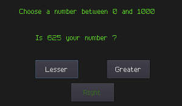
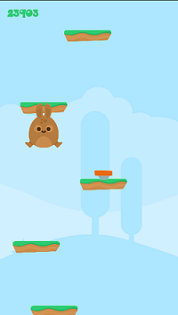
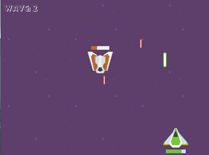
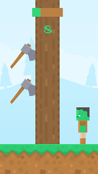
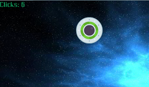

# Godot Learn Projects

Projects to learn Godot which created and coded by me with some various tutorial's help.

- ## Number Guesser

- ## Platform Jump

- ## Space Attack

- ## Tree Puncher

- ## Ufo Click

## ʕ•㉨•ʔ